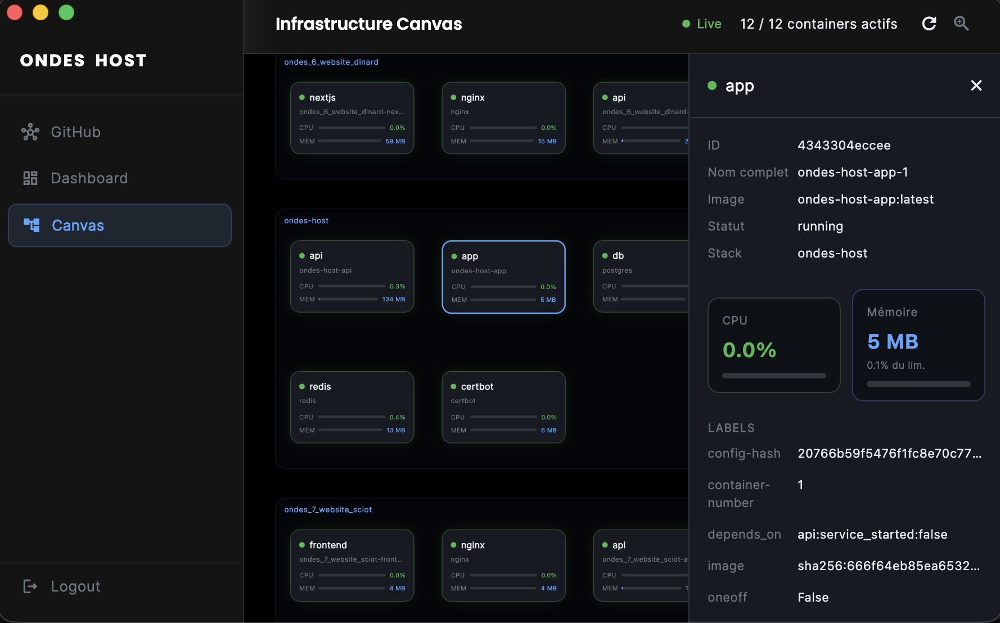

⚠️WORK IN PROGRESS!
<div align="center">

# Ondes HOST

### Your Self-Hosted Infrastructure — Deployed in One Command.

**A modern, open-source WEB Infrastructure, for everyone**

Deploy GitHub/(Gitlab 🏗️) projects as Docker Stacks, manage NGINX vhosts, issue SSL certs, run SSH sessions, and monitor your infrastructure — all from a powerful and easy interface.

[](https://www.djangoproject.com/)
[](https://flutter.dev/)
[](https://docs.docker.com/compose/)
[](https://letsencrypt.org/)
[](https://github.com/MartinBellot/ONDES_HOST/pkgs/container/ondes-host-api)
[](LICENSE)

🌐 **[ondes.pro](https://ondes.pro)**

</div>

---



---

## Why Ondes HOST?

You've got a VPS. You've got GitHub repos. You want them running behind HTTPS **without** wrestling with config files at 2 AM.

Ondes HOST gives you:

- 🚀 **One-command VPS setup** — from bare metal to fully running dashboard in minutes
- 🐙 **GitHub → Docker in 3 clicks** — browse your repos, pick a branch, hit Deploy
- 🔒 **Automatic SSL** — DNS check → Certbot → HTTPS, all from the UI
- 📡 **Live everything** — deploy logs, container metrics, and SSH, all over WebSocket
- 🗺️ **Visual canvas** — see your whole infrastructure at a glance, draggable and zoomable
- 🪝 **CI/CD webhooks** — plug into GitHub Actions for zero-touch continuous deployment

---

## ⚡ Install on any VPS — one command

```bash
curl -fsSL https://raw.githubusercontent.com/MartinBellot/ONDES_HOST/main/deploy.sh | sudo bash
```

**That's it.** Paste this into any fresh VPS and walk away.
The script installs Docker, pulls the **pre-built images from GHCR** (no build step ⚡), configures secrets, runs migrations, and brings everything up — fully automated.

> Tested on: Ubuntu 20+ · Debian 11+ · CentOS/RHEL/Rocky/AlmaLinux 8+ · Fedora 37+
> Requires: root · 1 GB RAM · 5 GB disk · ports 80 & 443 free

---

## 📸 Screenshots

<!-- Replace the placeholder comments below with actual screenshot images once available -->

| | |
|---|---|
| <!-- SCREENSHOT: Dashboard overview with container count cards and Docker health banner -->  | <!-- SCREENSHOT: GitHub repo browser with branch selector and deploy button -->  |
| <!-- SCREENSHOT: Stack Detail — Logs tab with real-time deploy output -->  | <!-- SCREENSHOT: Domaine & SSL tab with DNS propagation checker -->  |
| <!-- SCREENSHOT: Infrastructure Canvas — zoomable graph of all running containers -->  | <!-- SCREENSHOT: SSH Terminal screen with live WebSocket shell -->  |

> 📌 *Screenshots coming soon! Run the app locally and send us yours — see [CONTRIBUTING.md](CONTRIBUTING.md).*

---

## 🚀 Deploy to VPS — One Line

```bash
curl -fsSL https://raw.githubusercontent.com/MartinBellot/ONDES_HOST/main/deploy.sh | sudo bash
```

> **Tested on:** Ubuntu 20.04/22.04/24.04 · Debian 11/12 · CentOS/RHEL/Rocky/AlmaLinux 8+ · Fedora 37+
> **Requirements:** root access, 1 GB RAM, 5 GB free disk, ports 80 & 443 free.

### 🐳 Pre-built Docker images

Every [GitHub Release](https://github.com/MartinBellot/ONDES_HOST/releases) automatically builds and publishes Docker images to GHCR.
The deploy script pulls them by default — **the VPS never needs to compile anything**.

| Image | Tags |
|-------|------|
| `ghcr.io/martinbellot/ondes-host-api` | `latest`, `v1.x.x` |
| `ghcr.io/martinbellot/ondes-host-app` | `latest`, `v1.x.x` |

To force a local build from source instead:

```bash
curl -fsSL https://raw.githubusercontent.com/MartinBellot/ONDES_HOST/main/deploy.sh \
  | sudo ONDES_BUILD=1 bash
```

<details>
<summary><strong>⚙️ What the script does (19 steps)</strong></summary>

| Step | Action |
|---|---|
| 1 | **Privilege check** — aborts immediately if not run as root |
| 2 | **OS detection** — auto-selects `apt-get` / `dnf` for all supported distros |
| 3 | **Resource sanity** — warns if < 1 GB RAM or < 5 GB free disk |
| 4 | **Port audit** — detects anything already bound to 80, 443, 3000, 8000, 5432, 6379 |
| 5 | **Conflicting servers removed** — stops & purges system NGINX, Apache, Lighttpd, Caddy |
| 6 | **System deps** — installs `curl`, `git`, `openssl`, `ca-certificates`, `gnupg` |
| 7 | **Docker Engine** — skips if already installed; uses official `get.docker.com` bootstrap |
| 8 | **Docker Compose v2** — plugin via distro package manager or standalone binary |
| 9 | **Project directory** — uses current folder or clones to `/opt/ondes-host` |
| 10 | **`.env` security validation** — auto-generates `SECRET_KEY` & `POSTGRES_PASSWORD`, warns on weak/placeholder values, prompts for your domain and Certbot email |
| 11 | **Docker socket** — `chmod 660 /var/run/docker.sock` |
| 12 | **Pull base images** — `postgres`, `redis`, `nginx`, `certbot` pre-pulled |
| 13 | **Pull app images** — `docker compose pull api app` from GHCR (falls back to local build if unavailable) |
| 14 | **Launch** — `docker compose up -d --remove-orphans` |
| 15 | **Health polling** — waits up to 180 s for API readiness |
| 16 | **Migrations** — `python manage.py migrate --noinput` |
| 17 | **Superuser** — interactive prompt to create a Django admin account |
| 18 | **UFW firewall** — opens 22/80/443, blocks 5432/6379/8000/3000 from outside |
| 19 | **Summary** — prints your public IP, service URLs and handy management commands |

```bash
# Override defaults
export ONDES_REPO_URL="https://github.com/YourFork/ONDES_HOST.git"
export ONDES_DIR="/opt/ondes-host"
export ONDES_BUILD=1          # build from source instead of pulling GHCR images
curl -fsSL https://raw.githubusercontent.com/MartinBellot/ONDES_HOST/main/deploy.sh \
  | sudo -E bash
```

</details>

---

## 🏗️ Project Structure

```
ondes-host/
├── api/                  # Django 5 backend (REST + WebSockets via Channels/Daphne)
│   ├── apps/
│   │   ├── authentication/   # JWT login, register, logout
│   │   ├── docker_manager/   # Container lifecycle + live metrics WebSocket
│   │   ├── github_integration/ # OAuth App flow, repo/branch/compose browser
│   │   ├── nginx_manager/    # Vhost CRUD, Certbot runner, DNS checker
│   │   ├── ssh_manager/      # WebSocket SSH terminal (Paramiko)
│   │   └── stacks/           # Full deploy pipeline, CI/CD webhooks, NGINX auto-detect
│   └── config/               # Django settings, ASGI, URLs
├── app/                  # Flutter frontend (macOS + web)
│   └── lib/
│       ├── screens/          # All UI screens (see below)
│       ├── providers/        # State management (Provider)
│       ├── services/         # API & WebSocket clients
│       └── widgets/          # Reusable UI components
├── nginx/                # Platform-level NGINX config
├── docker-compose.yml    # Production service definitions
└── deploy.sh             # One-command VPS installer
```

---

## 🎯 Features At a Glance

<table>
<tr>
<td width="50%">

### 🐙 GitHub Integration
- Connect via OAuth App (credentials stored in DB — no server restart needed)
- Browse all your repos, filter by name
- Select branch, pick a `docker-compose.yml`, set env vars
- Auto-detects compose files across your repo tree

</td>
<td width="50%">

### 📦 Stack Deployment
- Full `git clone → docker compose up --build` pipeline
- `nginx` & `certbot` services auto-stripped from repo compose (platform manages them)
- Real-time streaming deploy logs via WebSocket
- Start / Stop / Restart / Redeploy from the detail view

</td>
</tr>
<tr>
<td>

### 🌐 NGINX & SSL
- Per-stack multi-domain vhost management
- **Multi-service routing** via `route_overrides` — e.g. `/api/ → :8001`, `/ → :3001`
- **`include_www`** flag generates `www.` redirect blocks automatically
- One-click Certbot with DNS propagation check wizard
- Certificate expiry tracking + auto-renewal every 12 h

</td>
<td>

### 🗺️ Live Infrastructure Canvas
- Zoomable (0.3×–2.5×) draggable canvas of all running containers
- Grouped by Compose project
- CPU and memory bars updated live every 3 s via WebSocket
- Colour-coded thresholds: 🟢 < 40% · 🟡 < 80% · 🔴 ≥ 80%
- Click any node → side-panel with full details

</td>
</tr>
<tr>
<td>

### 🔒 DNS Propagation Checker
- Per-vhost **Vérifier DNS** button
- Compares server public IP vs. resolved A record
- Auto-polls every 15 s until propagated
- Blocks Certbot from running until DNS is confirmed ✅

</td>
<td>

### 🪝 CI/CD Webhooks
- Each stack gets a unique secret token (UUID)
- `POST /api/stacks/{id}/webhook/` with `Authorization: Bearer <token>`
- Triggers a full redeploy + streams logs
- Drop-in with GitHub Actions, GitLab CI, or any HTTP client

</td>
</tr>
<tr>
<td>

### 💻 SSH Terminal
- Live WebSocket shell powered by Paramiko
- Password or private key authentication
- Interactive shell or one-shot command execution

</td>
<td>

### 🐳 Docker Manager
- List all containers with live status
- Start, stop, remove
- Create new containers from the UI
- Docker daemon health check & version info

</td>
</tr>
</table>

---

## ⚡ Quick Start (Local / Docker)

### 1. Configure environment

```bash
cp .env.example .env
# Edit .env — change SECRET_KEY and POSTGRES_PASSWORD at minimum
```

### 2. Start with Docker Compose

```bash
docker-compose up --build
```

| Service | URL |
|---|---|
| 🖥️ Frontend | http://localhost:3000 |
| ⚙️ API | http://localhost:8000/api/ |
| 🔧 Admin | http://localhost:8000/admin/ |

### 3. Create a superuser

```bash
docker-compose exec api python manage.py createsuperuser
```

---

## 🛠️ Local Development (without Docker)

### Backend

```bash
cd api
python -m venv .venv && source .venv/bin/activate
pip install -r requirements.txt
python manage.py migrate
# SQLite + InMemoryChannelLayer used automatically — no Postgres/Redis needed
python manage.py runserver
# For full WebSocket support:
daphne -b 0.0.0.0 -p 8000 config.asgi:application
```

### Flutter — macOS desktop

```bash
cd app
flutter pub get
flutter run -d macos
```

### Flutter — web

```bash
cd app
flutter run -d chrome \
  --dart-define=API_URL=http://localhost:8000/api \
  --dart-define=WS_URL=ws://localhost:8000
```

---

## 🔌 GitHub OAuth Setup

OAuth credentials live in the database — you never touch `.env` for this.

1. Open the app → **GitHub** screen.
2. The wizard shows your **Authorization callback URL** — copy it.
3. Go to [github.com/settings/developers](https://github.com/settings/developers) → *New OAuth App*.
   - Homepage URL: `http://localhost:3000` (or your domain)
   - Callback URL: paste what you copied
4. Copy **Client ID** + generate **Client Secret**.
5. Paste both into the wizard → **Save & continue**.
6. Click **Connect with GitHub** — OAuth opens in your system browser.

> Credentials are stored in the `GitHubOAuthConfig` singleton model. To reconfigure, click *Reconfigure OAuth App*.

---

## 🔄 CI/CD Webhook Example

Add this step to your GitHub Actions workflow for zero-touch deploys:

```yaml
- name: Trigger Ondes HOST redeploy
  run: |
    curl -X POST https://your-server.com/api/stacks/1/webhook/ \
      -H "Authorization: Bearer ${{ secrets.ONDES_WEBHOOK_TOKEN }}"
```

---

## 🏠 Migrate an Existing Site to Ondes HOST

Sites with their own nginx container should follow the **site-internal nginx pattern**:

<details>
<summary><strong>Step-by-step migration guide</strong></summary>

### Adapting the site's repo

| Change | Why |
|---|---|
| Map nginx from `80:80` → unique port (e.g. `8081:80`) | Ondes HOST owns ports 80 & 443 |
| Remove `certbot` service | Ondes HOST manages all TLS |
| Remove SSL `server` blocks — keep only `listen 80` | Platform handles HTTPS termination |
| Replace `$scheme` with `$http_x_forwarded_proto` | Upstream apps see correct protocol |
| Remove ACME challenge location block | Platform's nginx handles it |
| Remove certbot volume mounts | No longer needed |

### For Django services in the repo

```python
# settings.py
MIDDLEWARE = [
    'django.middleware.security.SecurityMiddleware',
    'whitenoise.middleware.WhiteNoiseMiddleware',  # ← add here
    ...
]
STATICFILES_STORAGE = 'whitenoise.storage.CompressedManifestStaticFilesStorage'
SECURE_PROXY_SSL_HEADER = ('HTTP_X_FORWARDED_PROTO', 'https')
SECURE_SSL_REDIRECT = False
DATABASES = {'default': {'ENGINE': 'django.db.backends.sqlite3',
                          'NAME': os.environ.get('DB_PATH', BASE_DIR / 'db.sqlite3')}}
```

### Deploying

1. Push the adapted repo to GitHub.
2. Deploy via Ondes HOST **Stacks** tab.
3. In **Domaine & SSL**, create a vhost pointing to `8081` (your site's internal port). No `route_overrides` needed.
4. Enable **include www** if needed.
5. Verify DNS → **Activer SSL** — done. ✅

> ⚠️ **Always back up your data before migrating!**

</details>

---

## 🔗 API Reference

<details>
<summary><strong>Auth endpoints</strong></summary>

| Method | Endpoint | Description |
|---|---|---|
| `POST` | `/api/auth/register/` | Register user |
| `POST` | `/api/auth/login/` | Obtain JWT tokens |
| `POST` | `/api/auth/refresh/` | Refresh access token |
| `POST` | `/api/auth/logout/` | Blacklist refresh token |
| `GET`  | `/api/auth/me/` | Current user profile |

</details>

<details>
<summary><strong>Docker endpoints</strong></summary>

| Method | Endpoint | Description |
|---|---|---|
| `GET`  | `/api/docker/status/` | Docker daemon health + version |
| `GET`  | `/api/docker/containers/` | List all containers |
| `POST` | `/api/docker/containers/create/` | Deploy a new container |
| `POST` | `/api/docker/containers/{id}/start/` | Start |
| `POST` | `/api/docker/containers/{id}/stop/` | Stop |
| `POST` | `/api/docker/containers/{id}/remove/` | Remove |

</details>

<details>
<summary><strong>GitHub endpoints</strong></summary>

| Method | Endpoint | Description |
|---|---|---|
| `GET/POST/DELETE` | `/api/github/config/` | Manage OAuth App credentials |
| `GET`  | `/api/github/oauth/start/` | Get OAuth authorize URL |
| `GET`  | `/api/github/oauth/callback/` | OAuth redirect handler |
| `GET`  | `/api/github/profile/` | Connected GitHub profile |
| `DELETE` | `/api/github/profile/` | Disconnect GitHub |
| `GET`  | `/api/github/repos/` | List repos (paginated) |
| `GET`  | `/api/github/repos/{owner}/{repo}/branches/` | List branches |
| `GET`  | `/api/github/repos/{owner}/{repo}/compose-files/` | Find compose files |

</details>

<details>
<summary><strong>Stacks endpoints</strong></summary>

| Method | Endpoint | Description |
|---|---|---|
| `GET/POST` | `/api/stacks/` | List / create stacks |
| `GET/PUT/DELETE` | `/api/stacks/{id}/` | Detail / update / delete |
| `POST` | `/api/stacks/{id}/deploy/` | Trigger deploy |
| `POST` | `/api/stacks/{id}/action/` | `start` / `stop` / `restart` |
| `GET`  | `/api/stacks/{id}/logs/` | Static logs (`?lines=N`) |
| `GET/PATCH` | `/api/stacks/{id}/env/` | Read / update env vars |
| `GET`  | `/api/stacks/{id}/vhosts/` | List NGINX vhosts |
| `GET`  | `/api/stacks/{id}/containers/` | Running containers for this project |
| `GET`  | `/api/stacks/{id}/check-update/` | Compare deployed SHA vs. latest on branch |
| `POST` | `/api/stacks/{id}/webhook/` | CI/CD trigger (`Authorization: Bearer <token>`) |
| `GET`  | `/api/stacks/{id}/detect-nginx/` | Dry-run NGINX auto-detect (no DB writes) |

</details>

<details>
<summary><strong>NGINX endpoints</strong></summary>

| Method | Endpoint | Description |
|---|---|---|
| `GET/POST` | `/api/nginx/vhosts/` | List / create vhosts |
| `GET/PATCH/DELETE` | `/api/nginx/vhosts/{id}/` | Detail / update / delete |
| `POST` | `/api/nginx/vhosts/{id}/certbot/` | Run Certbot (`{"email": "…"}`) |
| `GET`  | `/api/nginx/vhosts/{id}/cert-status/` | Refresh cert expiry from disk |
| `GET`  | `/api/nginx/vhosts/{id}/check-dns/` | DNS propagation check |

> **`route_overrides`** — JSON array for multi-service stacks. Example: `[{"path": "/api/", "upstream_port": 8001}, {"path": "/", "upstream_port": 3001}]`. Generates a single `server` block with sorted `location` entries.

</details>

<details>
<summary><strong>WebSocket endpoints</strong></summary>

| URL | Purpose |
|---|---|
| `ws://…/ws/ssh/` | Live SSH terminal |
| `ws://…/ws/stacks/{id}/logs/` | Real-time deploy logs |
| `ws://…/ws/metrics/?token=<jwt>` | Live container CPU/MEM — pushed every 3 s |

</details>

---

## 🧰 Tech Stack

| Layer | Technology |
|---|---|
| **Backend** | Django 5, Django REST Framework, Django Channels 4, Daphne (ASGI) |
| **Auth** | JWT — `djangorestframework-simplejwt` with token blacklisting |
| **Docker control** | `docker` SDK 7.1+ — mounted socket |
| **SSH** | Paramiko 3.4 |
| **GitHub OAuth** | OAuth 2.0 — credentials in DB, zero env-var config |
| **NGINX management** | `pyyaml` (compose parsing), `cryptography` (cert expiry) |
| **SSL** | Let's Encrypt via `certbot/certbot:latest` — on-demand + 12 h auto-renewal |
| **Database** | SQLite (local dev) / PostgreSQL 15 (production) |
| **Cache / WS layer** | InMemoryChannelLayer (local) / Redis 7 (production) |
| **Frontend** | Flutter 3.43 — macOS desktop + web |
| **State management** | Provider |
| **HTTP client** | Dio 5.4 |
| **Fonts** | Google Fonts — Inter + JetBrains Mono |

---

## 🤝 Contributing

We'd love your help! Whether it's a bug fix, a new feature, a translation, or a screenshot — every contribution counts.

👉 Read [CONTRIBUTING.md](CONTRIBUTING.md) to get started.

---

## 📄 License

MIT © [Martin Bellot](https://github.com/MartinBellot)

---

<div align="center">

Made with ❤️ and way too much ☕

**[ondes.pro](https://ondes.pro)** · [Report a bug](https://github.com/MartinBellot/ONDES_HOST/issues) · [Request a feature](https://github.com/MartinBellot/ONDES_HOST/issues)

</div>
